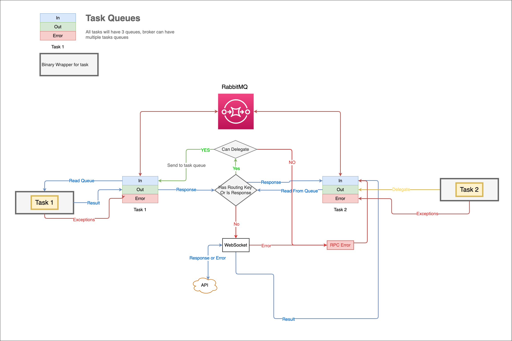

<!-- Docs links -->

  

<h1 align="center">rallf-ce-broker</h1>

  
Brokes messages between rallf Tasks, Skills, API, etc...

****

## Usefull commands
### Run Broker
You can run the broker in a couple of ways:
* `docker-compose up broker` **prefered**
* `npm run bin`  
* `node bin/broker.js`  

This will expose a tcp server, available at: `rallf-ce-broker:3000`

> ### For development is better to use `broker-dev`
> `docker-compose up broker-dev`

### Run Rabbit (test)
Launches a RabbitMQ instance.

* `docker-compose up rabbit`
* 
Available at: `http://localhost:9001`

### Run Crossbar - ws (test)
Launches a Crossbar.io router and wamp server.

`docker-compose up crossbar-server`

Available at: `ws://127.0.0.1:9000/ws`

### Run tests
`docker-compose up test`

## Metodos
### Websocket 
Tratamiento de errores usando, error first callback.
En el callback el primer argumento sera siempre el error y el segundo el resultado

La api deberia tener estos metodos:
* `delegate`
* `log`

## Diagram

